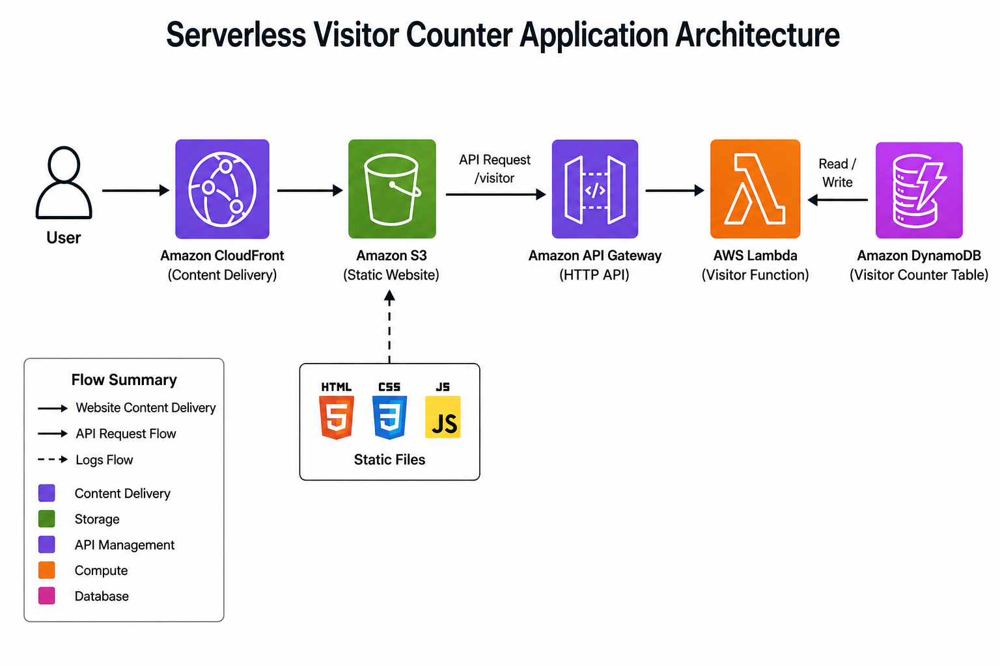

# Serverless Web Application on AWS

Hey there! 👋 Welcome to my Serverless Web Application project. 

## 🌟 Project Overview
This project is a hands-on exploration into the world of serverless cloud computing. The goal was to build a fully functional, highly available web application from scratch without provisioning or managing a single traditional server. It acts as a live visitor counter, updating seamlessly every time someone lands on the page. By connecting various AWS services, I wanted to showcase how modern cloud-native applications handle everything from static hosting to database interactions.

## 🏗️ Architecture
Here's a bird's-eye view of how all the pieces fit together:

## 🛠️ AWS Services Used
To make this work, I hooked up a few core AWS services:
- **S3 (Simple Storage Service):** Acts as the foundation, hosting all my frontend static files (HTML, CSS, JS).
- **CloudFront:** A global CDN that sits in front of S3, ensuring the site loads blazing fast for users anywhere in the world while adding a layer of security.
- **API Gateway:** The front door for the backend. It receives requests from the web app and routes them to the right place.
- **Lambda:** The brains of the operation! This serverless compute service runs the backend logic (updating and fetching the visitor count) only when needed.
- **DynamoDB:** A fast, serverless NoSQL database where the visitor count data is actually stored.

## ✨ Features
- **Real-time Visitor Counter:** Automatically tracks and displays total visits to the site.
- **Fully Serverless:** Scales automatically with zero server maintenance.
- **Low Latency Delivery:** Content is cached globally via CloudFront.
- **Secure Access:** Configured with IAM roles following least-privilege principles and Origin Access Control (OAC).
- **API-Driven:** Clean separation of frontend and backend using REST API concepts.

## 🎥 Demo Video
Want to see it in action? Check out the demo!
*(Demo video link coming soon...)* <!-- TODO: Add YouTube link here -->

## 📸 AWS Console Screenshots
Here is a peek behind the scenes at my AWS setup:

Click to view screenshots

 

**S3 Bucket**

**CloudFront Distribution**

**API Gateway**

**Lambda Function**

**DynamoDB Table**

## 🧗 Challenges Faced
Building this wasn't entirely smooth sailing. Here are some of the hurdles I hit and how I fixed them:

- **The CloudFront Distribution:** 
  - *Issue:* I couldn't delete a CloudFront distribution after I had already deleted the S3 bucket it pointed to.
  - *Fix:* CloudFront still had the deleted bucket as its origin. I had to disable the distribution, remove the origin config, wait for the deployment to finish, and *then* delete it.
- **Lambda's Database Block:** 
  - *Issue:* My Lambda function was failing to access DynamoDB.
  - *Fix:* Turns out it was missing IAM permissions! I attached a specific, least-privilege IAM policy that only allowed the exact DynamoDB actions the function needed.
- **"AccessDenied" from S3:** 
  - *Issue:* Even with a valid Origin Access Control (OAC) set up, CloudFront was getting an access denied error from S3.
  - *Fix:* My bucket policy had gone stale because I recreated the OAC a few times. I created one clean OAC and let CloudFront auto-generate the correct, matching bucket policy.
- **The "Ghost" API Stage:** 
  - *Issue:* I created a second API Gateway stage thinking it was a way to verify my `$default` deployment. I ended up with two live URLs!
  - *Fix:* Once I realized stages are separate deployment targets, I used `curl` to confirm both hit the same backend, then simply deleted the extra stage and kept `$default` as my single source of truth.

## 🚀 Future Improvements
There's always room to grow! In the future, I plan to:
- Add a CI/CD pipeline (e.g., GitHub Actions) to automate deployments whenever I push new code.
- Implement AWS WAF (Web Application Firewall) to protect the API Gateway from malicious requests.
- Add more robust error handling and monitoring using AWS CloudWatch.
- Integrate a custom domain name using Route 53 and AWS Certificate Manager for HTTPS.

---
*Feel free to explore the code or reach out if you have any questions about the setup!*
